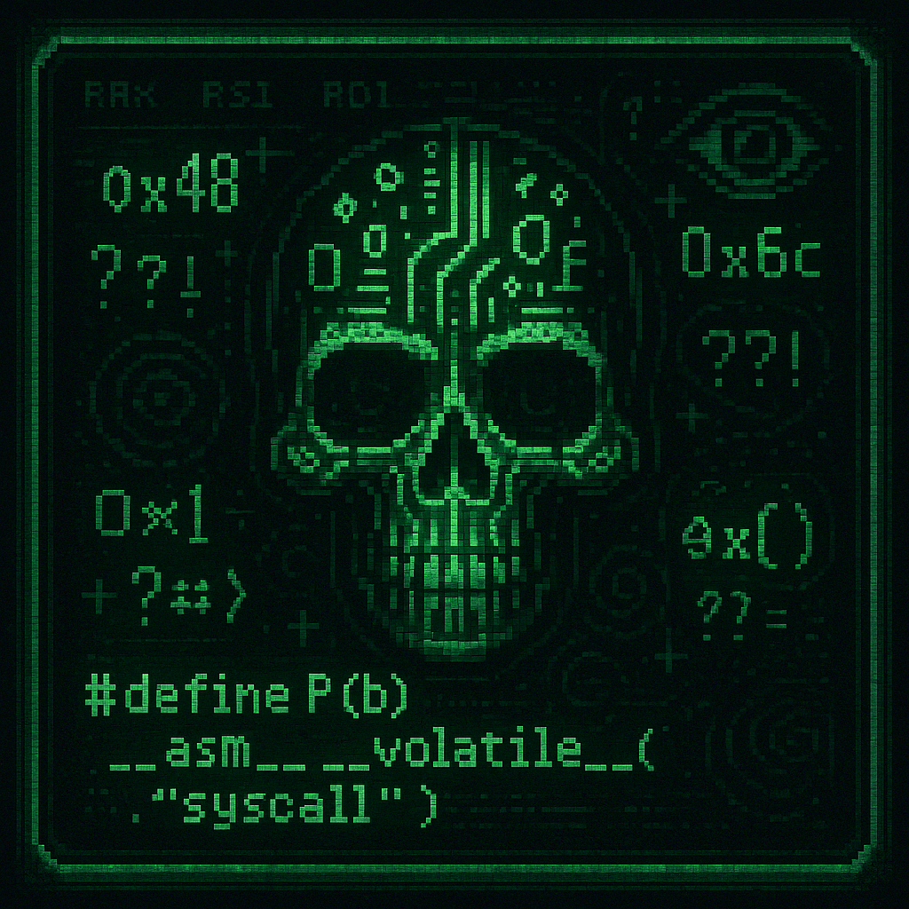

# chw

Within this repository lies cursed C code — a tangle of arcane logic that unsettles the minds of ordinary folk.
Those unfit to dance with chaos should look away — this path leads only deeper into the void.

*In the forgotten corners of cyberspace, where compiler warnings echo like distant thunder, this grimoire was forged. Each line etched in C bears the fingerprints of madness — incantations whispered through pointers and hex. This is not a place for the sane.
Here, logic loops twist into infinite spirals, and macros chant in recursive tongues. It is said those unprepared who gaze too long upon the source lose track of time... and sometimes, themselves.
Only the techno-shamans — guardians of the low-level and keepers of undefined behavior — may tread these shadowed paths. They alone can interpret the runes, appease the segmentation gods, and perhaps, just perhaps... refactor the curse.*
